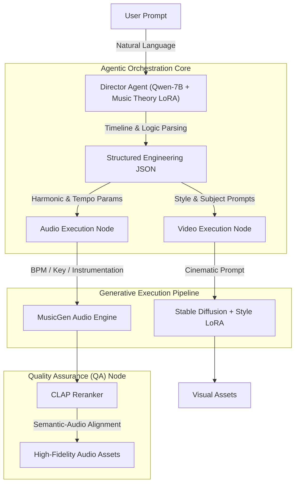

# AuraFlow: Multimodal AI Co-Pilot for Video Creators

   

**AuraFlow** is an end-to-end, agentic generative AI system designed to solve the "last mile" bottleneck in commercial video post-production. Operating as an autonomous "Virtual Director," AuraFlow translates abstract emotional and narrative prompts into precise, theoretically sound audio engineering parameters and aesthetically consistent visual assets.

It eliminates the friction of manual royalty-free music searching and stock footage curation by deploying a multi-agent orchestration workflow.


## 🎬 The "Why" Scenario: Solving the Post-Production Bottleneck

Imagine editing an **commercial summer lifestyle vlog**. You need an instrumental background track that avoids frequency masking with human voices, dynamically shifts emotion at specific timestamps, and requires bridging B-roll for scene transitions.

* **The Industry Friction:** Editors spend countless hours navigating licensing platforms (e.g., Epidemic Sound) for tracks that almost fit, and stock sites for visuals that often lack aesthetic cohesion.
* **The AuraFlow Solution:** ou simply instruct the Agent in natural language:
    > *"I need an instrumental BGM for a summer vlog. At the 0:15 mark, transition the harmonic progression and mood to a warm, soothing vibe for a stargazing scene. Also, generate a 5-second cinematic B-roll of a sunset over the sea to bridge the transition."*
    
    AuraFlow's autonomous agent parses the timeline, extracts musical and visual parameters, triggers the respective generative engines, and evaluates the output—delivering production-ready assets in seconds.

<div align="center">
  
</div>


## 🏗 System Architecture

AuraFlow separates **Orchestration (Reasoning)** from **Execution (Generation)** using a decoupled Dual-LoRA framework, allowing for precise control over both musical theory and visual aesthetics.




## 🚀 Key Features & Technical Highlights
1. **Autonomous Agent Orchestration**

Unlike traditional chatbots, AuraFlow functions as a task-oriented agent. It autonomously decodes narrative intent into structured, timeline-based actions. The **fine-tuned Qwen-7B model** acts as the "brain," managing tool-calling for downstream audio and image generation APIs based on contextual reasoning.

2. **Expert-Level Music Theory SFT**

To bridge the gap between AI generation and professional audio engineering, the LLM reasoning core was fine-tuned on **a custom SFT dataset** (~300 entries). Grounded in formal harmonic analysis and aural perception principles, this allows the agent to map abstract adjectives (e.g., "tense") to precise structural parameters (e.g., Key: D Minor, Tempo: 120bpm, Instrument: Pizzicato Strings, Phrygian dominant elements).

3. **High-Fidelity Audio Representation & Generation**

Leveraging advanced neural audio compression, AuraFlow integrates the **EnCodec architecture**. By utilizing Multi-scale Residual Vector Quantization (RVQ), the system achieves discrete, high-quality audio representation. This effectively minimizes frequency distortion and improves the harmonic continuity of the generated 32kHz audio tracks.

4. **Automated Reranking & Quality Control (CLAP)**

To ensure commercial viability and reduce "AI hallucinations," AuraFlow implements a **QA loop**. A CLAP (Contrastive Language-Audio Pretraining) module operates as a filter on the inference side, quantifying the semantic similarity between the user's initial prompt and the generated audio, automatically reranking outputs to deliver the highest-matching asset.

5. **Dual-LoRA Aesthetic Control**

While the LLM-LoRA handles logic, a parallel **Style-LoRA trained** on **Stable Diffusion 1.5** ensures the generated B-roll avoids the generic "AI plastic look," maintaining a consistent, filmic grain suitable for professional Vlogs.


## 🛠 Tech Stack
* **Core Logic:** Python, LangChain

* **Backend:** FastAPI, Uvicorn

* **Frontend:** React, Vite, TailwindCSS (Pastel UI / Soft Tech aesthetic)

* **AI/ML:** LLM: Qwen-7B (Base), PEFT (LoRA)

* **Visuals:** PyTorch, Stable Diffusion 1.5

* **Audio:** MusicGen (via API/Local inference)


## 📥 Model Weights
Due to GitHub file size limits, the fine-tuned LoRA weights and model assets are hosted on HuggingFace:

👉 [Download Models on HuggingFace](https://huggingface.co/CaresseZ/aura-flow-assets)


## 🚧 Current Status & Limitations
* **Localhost Prototype:** The project currently runs fully on a local environment.

* **Video Generation:** Temporarily disabled due to hardware compute limitations.

* **Cloud Deployment:** Not yet deployed to cloud infrastructure due to GPU cost considerations.


## 🗺 Roadmap
### Phase 1 (Current)

* [x] Multimodal Agent orchestration (Text -> Audio + Image).

* [x] SFT of LLM for professional music theory parameterization.

* [x] Integration of CLAP for automated output reranking.

### Phase 2 (Productivity & Interaction)

* [ ] **Hum-to-BGM(Pitch Tracking):** Integrate pYIN pitch detection, allowing the Agent to ingest a hummed melody and output a fully arranged, multi-track MIDI/Audio stem.
      
* [ ] **ONNX Runtime Optimization:** Accelerate MusicGen inference via ONNX to enable near-real-time generation, paving the way for VST/AU plugin formats.

* [ ] **Pomodoro Focus Mode:** Custom "Focus Zones" where users can upload a photo to generate a dynamic Lofi background + music timer.


### Phase 3 (Cloud)

* [ ] Deploy scalable REST APIs to HuggingFace Spaces or AWS SageMaker.

* [ ] Implement user preference memory for personalized aesthetic generation.


## 🔧 Getting Started (Local Dev)

1. Download the modle in HuggingFace
👉[Download Me Here](https://huggingface.co/CaresseZ/aura-flow-assets)
   
2. Clone the repository
```bash
git clone https://github.com/caressez15/Aura-Flow.git
cd Aura-Flow
```

3. Backend Setup
Open a terminal in the project root (/Aura-Flow):
```bash
# 1. Create and activate virtual environment
python3 -m venv venv
source venv/bin/activate  # MacOS/Linux
# .\venv\Scripts\activate  # Windows

# 2. Install dependencies
pip install -r requirements.txt

# 3. Set API Key (Required for Moonshot AI Base Model)
export MOONSHOT_API_KEY="sk-your_api_key_here"

# 4. Run the Backend Server
python3 -m uvicorn app.main:app --host 127.0.0.1 --port 8000 --reload
```

4. Frontend Setup
Open a new terminal window and navigate to the frontend folder:
```bash
cd aura_flow_demo

# Install dependencies and run
npm install
npm run dev
```
