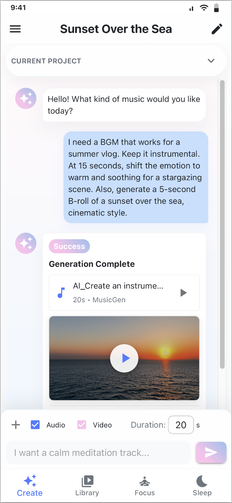
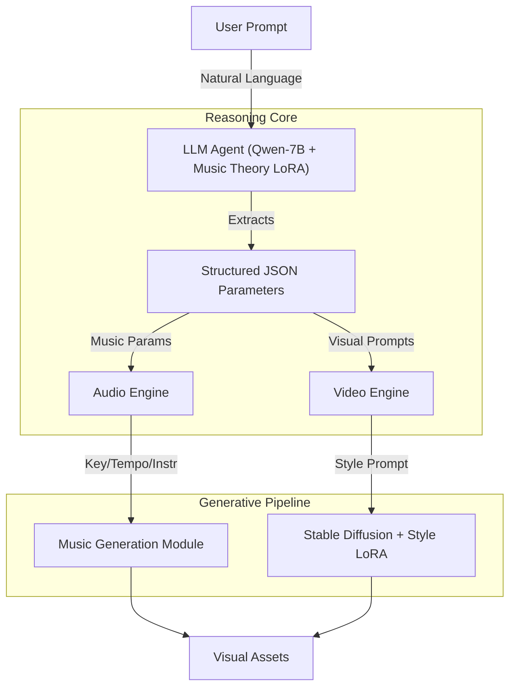

# AuraFlow: Multimodal AI Co-Pilot for Video Creators

   

**AuraFlow** is an end-to-end generative AI system designed to solve the "last mile" problem in video post-production. It acts as an intelligent director, translating abstract emotional prompts into precise, theoretically sound background music (BGM) and aesthetically consistent B-roll visuals.

## 🎬 The "Why": A Real-World Scenario

Imagine you are editing a **summer beach vlog**. The video contains dialogue, so you need a pure instrumental track that won't clash with human voices.

* **The Challenge:** You need the music to start upbeat but shift to a "warm, soothing" vibe at the 0:15 mark to match a scene of stargazing with friends. You also realize you are missing footage for the transition and need a copyright-free, atmospheric clip of a "sunset over the sea" to bridge the scenes.
* **The Current Solution:** You spend hours searching Epidemic Sound for a track that *might* fit, and Pexels for a stock video that doesn't look like generic stock footage.
* **The AuraFlow Solution:** You simply tell the agent:
    > *"I need a BGM that works for a summer vlog. Keep it instrumental. At 15 seconds, shift the emotion to warm and soothing for a stargazing scene. Also, generate a 5-second B-roll of a sunset over the sea, cinematic style."*
    
    AuraFlow handles the reasoning, parameter extraction, and asset generation in one go.

<div align="center">
  
</div>


## 🏗 System Architecture

AuraFlow separates **Logic (Reasoning)** from **Creativity (Generation)** using a decoupled Dual-LoRA architecture.




## 🚀 Key Features & Technical Highlights
1. Fine-Tuned LLM Reasoning (The "Brain")

Unlike generic chatbots, AuraFlow doesn't just "chat." It translates abstract emotions into engineering parameters.

* **Custom SFT Dataset:** Constructed a dataset (~300 entries) mapping abstract adjectives (e.g., "ambiguous," "tense") to concrete music theory parameters (e.g., Key: D Minor, Tempo: 120bpm, Instrument: Pizzicato Strings).

* **LLM-LoRA:** Fine-tuned Qwen-7B (Rank=32) to output structured JSON that drives the downstream generation engines, ensuring the music evolves dynamically over time.

2. Dual-LoRA Architecture

We decouple the technical stack to ensure high control:

* **LLM-LoRA:** Handles logic and instruction following (translating "sad" to "Minor Key").

* **Style-LoRA:** A separate adapter trained on Stable Diffusion 1.5 using a curated dataset of "Cinematic/Vlog" aesthetics. This solves the "AI plastic look" problem, ensuring generated B-roll has a consistent, film-like grain.


## 🛠 Tech Stack
* **Core Logic:** Python, LangChain

* **Backend:** FastAPI, Uvicorn

* **Frontend:** React, Vite, TailwindCSS (Pastel UI / Soft Tech aesthetic)

* **AI/ML:** LLM: Qwen-7B (Base), PEFT (LoRA)

* **Visuals:** PyTorch, Stable Diffusion 1.5

* **Audio:** MusicGen (via API/Local inference)


## 📥 Model Weights
Due to GitHub file size limits, the fine-tuned LoRA weights and model assets are hosted on HuggingFace:

👉 [Download Models on HuggingFace](https://huggingface.co/CaresseZ/aura-flow-assets)


## 🚧 Current Status & Limitations
* **Localhost Prototype:** The project currently runs fully on a local environment.

* **Video Generation:** Temporarily disabled due to hardware compute limitations.

* **Cloud Deployment:** Not yet deployed to cloud infrastructure due to GPU cost considerations.


## 🗺 Roadmap
### Phase 1 (Current)

* [x] Multimodal pipeline setup (Text -> Audio + Image).

* [x] Fine-tuning of LLM for music theory parameters.

* [x] React Frontend with chat interface.

### Phase 2 (Productivity & Interaction)

* [ ] **Hum-to-BGM:** Integrate pYIN (pitch detection) to allow users to hum a melody, which AuraFlow expands into a full arrangement.

* [ ] **Pomodoro Focus Mode:** Custom "Focus Zones" where users can upload a photo to generate a dynamic Lofi background + music timer.


### Phase 3 (Cloud)

* [ ] Deploy inference endpoints to HuggingFace Spaces or AWS SageMaker.

* [ ] Real-time video preview generation.


## 🔧 Getting Started (Local Dev)

1. Download the modle in HuggingFace
👉[Download Me Here](https://huggingface.co/CaresseZ/aura-flow-assets)
   
2. Clone the repository
```bash
git clone https://github.com/caressez15/Aura-Flow.git
cd Aura-Flow
```

3. Backend Setup
Open a terminal in the project root (/Aura-Flow):
```bash
# 1. Create and activate virtual environment
python3 -m venv venv
source venv/bin/activate  # MacOS/Linux
# .\venv\Scripts\activate  # Windows

# 2. Install dependencies
pip install -r requirements.txt

# 3. Set API Key (Required for Moonshot AI Base Model)
export MOONSHOT_API_KEY="sk-your_api_key_here"

# 4. Run the Backend Server
python3 -m uvicorn app.main:app --host 127.0.0.1 --port 8000 --reload
```

4. Frontend Setup
Open a new terminal window and navigate to the frontend folder:
```bash
cd aura_flow_demo

# Install dependencies and run
npm install
npm run dev
```